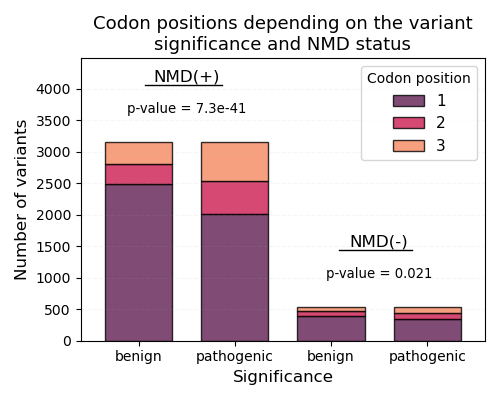

## Improving the prediction of genetic variant effect using large-scale human genome variation data  

  #### Students:
  * [Irina Grishchenko](https://github.com/grishchenkoira) (место работы?)  
  * [Anastasiia Ivanova](https://github.com/nastasia-iv/) (место работы?)  
  #### Supervisor:
* Yury Barbitoff (Institute of Bioinformatics Research & Education)  
  
Evaluation of the functional effects of genetic variants is a crucial task for interpretation of NGS results in rare disease diagnostics. Besides, understanding of the functional consequences of genetic variants is no less important for enhancing our understanding of how and why variants may have different effects in different cases. Recently, the Genome Aggregation Database (gnomAD) released an updated version of the human genome variation dataset, now including as many as 800,000+ human exomes and genomes.  
  
The **goal** of this project is to utilize the gnomad v.4.0.0 dataset to improve the prediction of genetic variant effects and explore patterns of variation using different types of variants.  
   
To reach this goal, we work in several independent directions:  
* Analyze the effects of sequence context on variant frequencies. 
* Determine the parts of the gene sequence under increased evolutionary constraint. 
  
### Analysis of the effects of sequence context on variant frequencies  
During this task we explored the relationship between variant frequency and the corresponding codon change and neighboring codons for putative loss-of-function variants (stop gains).  
It is known that although predicted loss of function (pLoF) variants are highly deleterious and play important roles in disease biology, many of these variants may not actually result in loss of function. To get rid of potentially “false” LOFs, we took the following steps:  
* used variants only on *canonical* transcripts.  
* removed variants containing *LOF-flags* and *LOF-filter*.  
* added metrics for assessing biological variants *LOEUF* and *pext* to the data.  
  - the loss-of-function observed over expected upper bound fraction, or [LOEUF score](https://doi.org/10.1007/s00439-022-02509-x), is a metric that places each gene on a continuous scale of loss-of-function constraint. Low scores are highly correlated with disease genes and gene essentiality. Due to expected shifts in the LOEUF distribution between gnomAD v2.1.1 and v4.0, it recommemded to use a threshold of LOEUF < 0.6 for v4.0 and [LOEUF < 0.35 for v2](https://gnomad.broadinstitute.org/news/2024-03-gnomad-v4-0-gene-constraint/#loeuf-guidance). We use the threshold for gnomAD v.2 because data on LOEUF were taken specifically for this dataset.  
  - [pext](https://gnomad.broadinstitute.org/help/pext) (proportion expression across transcripts) summarizes the expression values of isoforms in tissues, etc. allows visualization of the expression status of exonic regions in tissues. For each option, we took the average pext value for all tissues and left only those for which this indicator exceeded 0.5. Information about pext boundaries is taken from [Singer-Berk M et al, 2023](https://www.ncbi.nlm.nih.gov/pmc/articles/PMC10029069/).  
* split the dataset into *nonsense-mediated decay (NMD) escaped* variants and *NMD undergo* variants. We use the code from [Torene et al., 2024](https://doi.org/10.1016/j.ajhg.2023.11.007). Full code is available [here](https://github.com/rebeccaito/nmd-escape/tree/main).    

All further analysis was carried out in parallel for both datasets.  
After dividing the dataset into conditionally pathogenic (AC < 2) and conditionally benign (AC >= 2), we obtained sequence contexts and the position of the variant in the codon. After comparing the contexts for the pathogenic and non-pathogenic dataset, we obtained the following results:  

1.  Most of the stopgain variants occur at the 1st position in the codon for both NMD(+) and NMD(-) datasets.  
   This is expected, because all three stop codons start at the same nucleotide. But the second and third nucleotides of the codon, although also important, can be more flexible and can undergo mutations more often without the occurrence of a stop codon.  
  
2.  Context analysis between pathogenic and non-pathogenic variants did not show statistically significant differences, with the exception of a possible statistical difference at -1 position for variants located in the first codon position for the NMD(+) dataset (p-value = 0.025).  

3.  Analysis using chi-square showed that the relationship between the variant codon position and the pathogenicity of the variant is statistically significant: NMD(+) p-value = 7.3e-41; NMD(-) p-value = 0.021.
   
